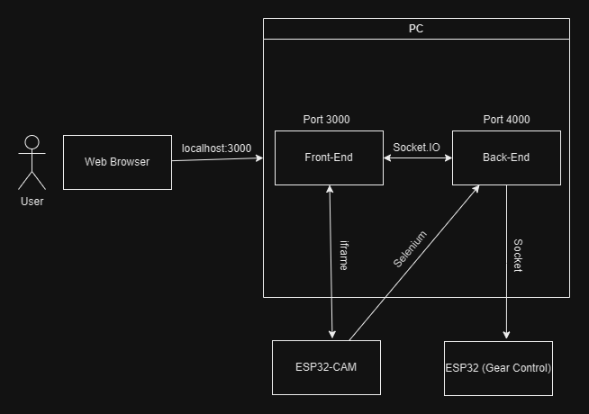

# Carro controlado por voz

O presente repositório objetiva armazenar os códigos e arquivos utilizados no carro controlado por voz. Tal projeto está sendo desenvolvido para a disciplina de Projeto Integrado de Computação II.

O projeto se trata de um robô autônomo capaz de seguir objetos informados pelo usuário via comandos de voz (via interface web).

# Arquitetura do projeto


De modo geral, podemos observar que existem quatro partes principais do projeto.

1. O Front-End: Responsável pela interação do usuário com o sistema. Aqui acontecem as interações como comando de voz e comandos direcionais do robô;
2. O Back-End: Responsável pelo tratamento das entradas dadas pelo usuário no Front-End e sua manipulação, envia comandos à ESP32 do controle dos motores, quando necessário. Também é responsável pela automação do movimento do robô;
3. O servidor da ESP32-CAM: Responsável pelo envio das imagens da camera e detecção de objetos;
4. ESP32 do controle de motores: Recebe comandos simples e os executa;

# Partes do projeto

## Front-end

Feito em JavaScript (Node.JS)

É onde o usuário interage com o sistema. São realizadas capturas de comandos de voz por meio da funcionalidade nativa do JavaScript. A captura de voz é ativada ao clicar no botão "Falar", o botão ficará vermelho e indicará que o usuário está sendo "ouvido", a mensagem da fala é tratada e a string correspondente ao comando enviada tanto ao servidor da ESP32-CAM quanto ao back-end. Os comandos suportadas seguem o padrão "procure uma xícara", "encontre uma pessoa" e afins.

Além disso, existem os botões direcionais, que fazem com que o robô se locomova em um dos quatro modos (para trás, para frente, gire para a esquerda ou gire para a direita), o robô se movimenta enquanto o botão for pressionado. Deve-se considerar um pequeno delay na comunicação. Também existe um botão emergencial vermelho "Para" que cessa o movimento dos motores.

A parte principal desse módulo seria a exibição da interface do servidor da ESP32-CAM, onde pode ser selecionado o objeto a ser procurado e podem ser feitos diversos ajustes.

**Observação:** Antes de interagir com a interface, clique em "Start Stream", para que a detecção seja iniciada.

### Comunica-se com
* Usuário, por meio de voz e cliques do mouse;
* ESP32-CAM, por meio de iframe e EventListeners;
* Back-End, por meio da biblioteca Socket.IO.

### Como iniciar
No diretório `src/web-application` execute os comandos:

```
npm install
npm run dev
```

## Servidor da ESP32-CAM

Desenvolvido em C++

A ESP32-CAM é responsável por receber os comandos de voz (via EventListener) para localizar os objetos. Utilizando uma inteligência artificial pré-treinada (COCO SSD), ele realiza o reconhecimento dos objetos.

### Comunica-se com
* Front-End, por meio de EventListeners e iframe;
* Back-End, por meio de Selenium, para envio de posição do objeto detectado (workaround necessário por conta de problemas com CORS).

### Como iniciar
Envie o código encontrado em `src/cam-embedded-code` para uma ESP32-CAM (certifique-se do modelo da lente ser OV2640), lembre-se de definir o SSID e senha da sua rede Wi-Fi. Antes de acoplar a placa ao carro, verifique o endereço IP do servidor e sua porta (configurada como 80 nesse repositório) e substitua no arquivo `src/web-application/pages/index.js` (na parte do iframe), assim a comunicação entre a camera e o front-end fica adequada. Também substitua no back-end (no arquivo `src/car-server/main.py`) para que a navegação autônoma funcione corretamente.

## Back-end

Feito em Python 

É onde são recebidos os comandos de direção mandados pelo front-end por meio de comunicação de socket (Flask em conjunto com Socket.IO) e onde é definido se a ESP32-CAM achou o objeto que está sendo procurado, com auxílio do Selenium. Além disso, é onde está o algoritmo de busca autonoma pelo objeto.

### Comunica-se com
* ESP32 do controle dos motores, por meio de socket;
* Front-End, por meio da biblioteca Socket.IO (em conjunto com Flask);
* ESP32-CAM, por meio de Selenium (workaround necessário por conta de problemas com CORS).

### Como iniciar

No diretório `src/car-server` execute `python3 main.py` tendo as dependências instaladas e tendo inserido o IP do servidor da ESP32-CAM.

## ESP32 (Controle dos motores)

Desenvolvido em C++

O módulo é responsável por receber os comandos de direção enviados pelo back-end através de comunicação de socket e executar toda a movimentação do carro. Neste módulo, não são enviados comandos, apenas recebidos e processados.

### Comunica-se com
* Back-End, por meio de socket. Recebe um determinado valor numérico (em forma de string de bytes de tamanho 1) que indica a ação a ser tomada. (0 para PARAR, 1 para GIRAR À ESQUERDA, 2 para GIRAR À DIREITA, 3 para ANDAR À FRENTE e 4 para ANDAR DE RÉ)

### Como inciar

No diretório `src/motor-embedded-code` está o código em arquivo único a ser instalado na ESP32, é necessário inserir no código o IPv4 do computador onde rodam o back-end e o front-end e a porta do back-end para que seja feita a comunicação corretamente.

# Dependências

* Rede Wi-Fi (deve ser uma rede 2.4GHz, não funciona em rede 5GHz e a mesma rede deve ser usada em todos os módulos);
* Computador (Para rodar o back-end e o front-end);
* ESP32 (Para rodar o código do motor);
* ESP32-CAM (Para rodar o código da camera);

## Dependências de software

* Node.JS;
* Python3.10
    * Flask (e Flask_SocketIO);
    * Selenium;
* Arduino IDE

## Hardware utilizado (além de sistemas embarcados)
* Chassi do robô e rodas
* Ponte H
* 2 baterias 9v
* Power Bank
* Jumpers
* Protoboard
* interruptor
* 2 motores PWD
